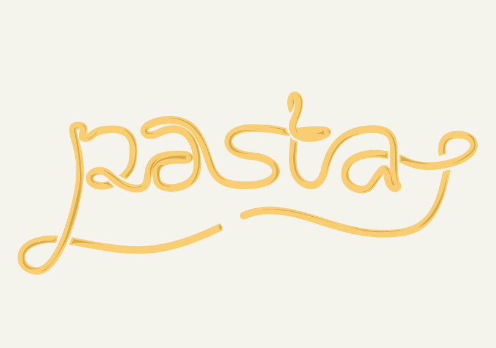

# Introduciton (Antipasto)
Base R provides a functionality to concatenate strings through the `paste`
functions. Using paste is nice and dandy, but the code can get quite difficult
to read. Especially if two paste functions need to be nested.

**Pasta** provides a set of infix functions to make concatenation noodlier.
This can make the code more in intuitive and readable.

# Examples (Primo Piatto)
Here are some tasty examples of the provided functionality:

```r
  require(pasta, quietly = TRUE)
  #
  examples <- c(
  'macaroni' %_% 'sauce',
  'ravioli' %-% 'recipe',
  'spaghetti' %.% 'code',
  'fussili' %//% 'farfalle',
  'pasta' %&% 'sciutta',
  'noodle' %&&% 'soup',
  'carbonara' %|% 'ragù',
  'spaghetti' %&&% 'al' %-% 'dente'
  )
  print(examples)
```

```
## [1] "macaroni_sauce"     "ravioli-recipe"     "spaghetti.code"    
## [4] "fussili/farfalle"   "pastasciutta"       "noodle soup"       
## [7] "carbonara|ragù"     "spaghetti al-dente"
```

As a less naive example let us assume that we want to create a fancy animation
with some screen-caps of our favorite spaghetti-western.
In the following is some `pasta` code that shows how you can download a set of
chosen pictures from one of the many nice cites that provide the captures


```r
  cap_url <- "http://www.caps.media/195/9-rio-bravo/full/rio-bravo-movie-screencaps.com"
  jpg_urls <- cap_url %-% c(4,5,264:268) %.% "jpg"
  for (i in 1:length(jpg_urls)) {
      download.file(jpg_urls[i], c("rio_bravo" %_% i %.% "jpg"), mode = "wb")
  }
```


